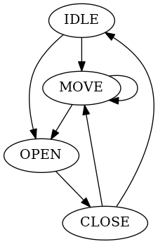

### Task

Develop "elevator simulator" console application.

App should display events:
* passing floor
* opening/closing doors

App should receive inputs:
* cabin button press
* floor button press

App should receive parameters at startup:
* building's floor count (5-20)
* floor height
* open/close doors time

### Implementation
Elevator algorithm could be represented with simple state machine.


Each state change occurs after predefined timeout.

Before moving algorithm decides direction using simple strategy:
* cabin buttons "agreeing" with current direction have top priority
* cabin buttons have greater priority than floor buttons
* if no buttons are pressed then switch to idle

### Running
Program uses [ANSI escape codes](https://en.wikipedia.org/wiki/ANSI_escape_code) to control output. Only VT100 terminals (any xterm-based) are fully supported.
```sh
mvn clean package
java -jar target/elevator.jar 10 3 1 5
```